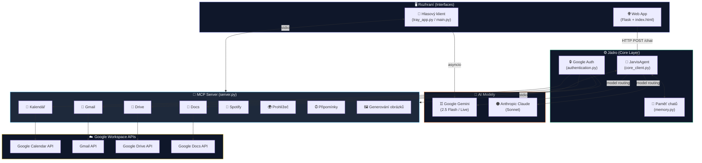
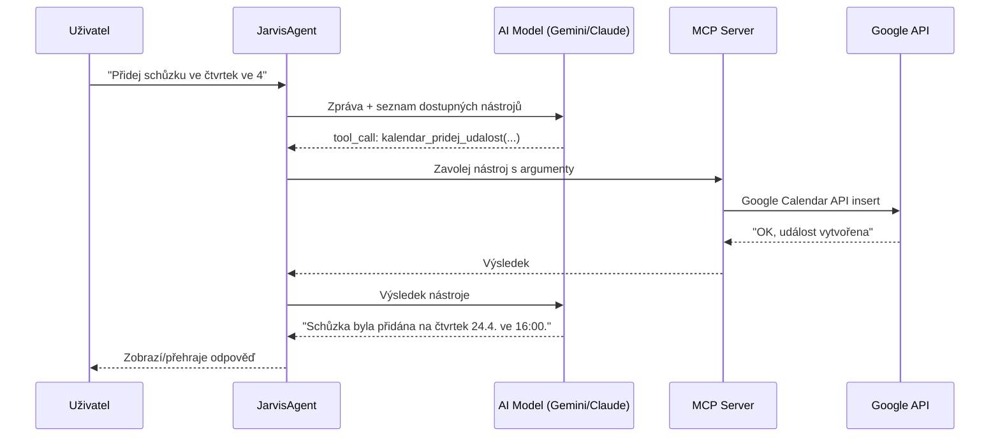

# 🤖 J.A.R.V.I.S. — AI Personal & Business Assistant

> **Modulární AI asistent s podporou hlasového, textového a autonomního rozhraní — postavený na protokolu MCP.**

J.A.R.V.I.S. není jen chatbot. Je to plnohodnotný AI agent s přímým přístupem k Google Workspace, Spotify, vlastním webovým prohlížečem, systémovými nástroji a možností rozšiřovat schopnosti **za běhu bez restartu**. Komunikuj s ním hlasem, textem nebo jej nech pracovat autonomně na pozadí.

---

## ✨ Proč Jarvis?

| Potřeba | Tradiční řešení | Jarvis |
|---|---|---|
| Správa kalendáře | Otevřít Google Calendar ručně | *„Jarvis, přidej schůzku ve čtvrtek ve 4"* |
| Přečíst emaily | Projít inbox sám | *„Jarvis, co mi přišlo důležitého?"* |
| Najít dokument | Hledat v Drive | *„Jarvis, otevři dokument Zápisky z hodiny"* |
| Pustit hudbu | Otevřít Spotify | *„Jarvis, pusť chill playlist"* |
| Připomenutí | Nastavit budík v telefonu | *„Jarvis, za 20 minut mi připomeň oběd"* |

---

## 📋 Obsah

- [Architektura systému](#architektura-systému)
- [Rozhraní — jak s Jarvisem komunikovat](#rozhraní--jak-s-jarvisem-komunikovat)
- [MCP — Model Context Protocol](#mcp--model-context-protocol)
- [Rozšiřování bez restartu](#rozšiřování-za-běhu-bez-restartu)
- [Přehled funkcí a jak je zavolat](#přehled-funkcí-a-jak-je-zavolat)
- [Osobní využití](#osobní-využití)
- [Firemní využití](#firemní-využití)
- [Instalace](#instalace)

---

## Architektura systému



---

## Rozhraní — jak s Jarvisem komunikovat

Jarvis podporuje **tři nezávislá rozhraní**. Všechna sdílejí stejný MCP server a přístup k nástrojům.

### 1. 🌐 Webové rozhraní (textový chat)

Klasický chat v prohlížeči. Spusť `app.py` a otevři `http://localhost:5000`.

```bash
python interfaces/web/app.py
```

- Více chatů najednou s historií (ukládáno do JSON souborů)
- Výběr modelu: Gemini 2.5 Flash, Gemini 2.0 Pro, **Claude Sonnet**
- Dashboard s počasím a přehledem kalendáře
- Generování obrázků přes Imagen 3

### 2. 🎤 Hlasový klient — Wake Word mód

Jarvis naslouchá na pozadí. Jakmile řekneš **„Jarvis"**, aktivuje se a odpoví hlasem.

```bash
python interfaces/voice/tray_app.py
```

Technologie: [Picovoice Porcupine](https://picovoice.ai/) pro detekci wake wordu + Google Gemini Live API pro real-time hlasovou konverzaci.

```
Systém startuje → [čeká v STANDBY]
Ty: "Jarvis, jaké mám dnes schůzky?"
Jarvis: 🎯 Detekce wake wordu → aktivuje se → odpoví hlasem → vrátí se do STANDBY
```

### 3. 🔴 Hlasový klient — Push-to-Talk (PTT) mód

Místo wake wordu **drž klávesu** (výchozí: `Home`) a mluv. Po puštění Jarvis zpracuje a odpoví.

Přepínání mezi módy přes ikonu v systray — **bez restartu**.

```
[PTT drž Home] → "Co mám v kalendáři na příští týden?" → [pustíš] → Jarvis odpoví
```

Výhody PTT: žádné falešné aktivace, funguje v hlučném prostředí, přesnější zpracování.

### Systray ovládání

Jarvis běží jako ikona v systémové liště s menu:
- Přepínání STANDBY / VYPNUTO
- Přepínání Wake Word ↔ PTT
- Výběr PTT klávesy (0, 9, F9, F10, Home, Insert...)

---

## MCP — Model Context Protocol

**MCP (Model Context Protocol)** je open standard od Anthropic, který umožňuje AI modelům bezpečně volat externí nástroje a služby.

### Jak to funguje



### Proč MCP?

- **Standardizace** — stejný server funguje pro Gemini i Claude bez úprav
- **Bezpečnost** — AI model nemá přímý přístup k API, jen volá pojmenované nástroje
- **Rozšiřitelnost** — přidat nový nástroj = napsat jednu Python funkci s dekorátorem `@mcp.tool()`
- **Transparentnost** — každé volání nástroje je loggováno a viditelné

### Struktura MCP serveru

```
mcp_servers/
├── server.py                    ← hlavní MCP server (FastMCP)
├── google_workspace/
│   ├── calendar_module.py       ← @mcp.tool() dekorátory pro kalendář
│   ├── gmail_manager.py         ← nástroje pro Gmail
│   ├── drive_manager.py         ← nástroje pro Google Drive
│   └── docs_manager.py          ← nástroje pro Google Docs
├── spotify/
│   └── spotify_manager.py       ← nástroje pro Spotify
├── browser_manager.py           ← otevírání URL a ukládání odkazů
├── pid_module.py                ← systémové nástroje
└── image_generation/
    └── image_tools.py           ← generování obrázků přes Imagen
```

---

## Rozšiřování za běhu bez restartu

Toto je jedna z klíčových vlastností architektury. **Nepotřebuješ restartovat Jarvise, aby se naučil nové nástroje.**

### Jak to funguje

Každá konverzace (session) spouští MCP server jako **nový subprocess**:

```python
# core_client.py — spustí se pro každou konverzaci znovu
server_params = StdioServerParameters(command="python", args=[self.server_script])
async with stdio_client(server_params) as (read, write):
    async with ClientSession(read, write) as session:
        await session.initialize()
        mcp_tools = await session.list_tools()  # ← načte aktuální seznam nástrojů
```

Každý `mcp_tools = await session.list_tools()` přečte **aktuální stav** `server.py`. To znamená:

1. Přidáš nový modul do `server.py` (např. `register_weather(mcp)`)
2. Napíšeš funkci s `@mcp.tool()` dekorátorem
3. **Příští konverzace** (další klik Odeslat / další aktivace wake wordeu) automaticky tento nástroj uvidí
4. AI model ho začne používat bez jakéhokoli restartu

### Příklad přidání nového nástroje

```python
# novy_modul.py
def register_weather(mcp):
    @mcp.tool()
    def zjisti_pocasi(mesto: str) -> str:
        """Zjistí aktuální počasí v daném městě."""
        # ... implementace
        return f"V {mesto} je 18°C, polojasno."

# server.py — přidáš jeden řádek:
from novy_modul import register_weather
register_weather(mcp)
```

Od teď Jarvis umí říct počasí. Žádný restart.

---

## Přehled funkcí a jak je zavolat

### 📅 Kalendář

| Nástroj | Kdy se zavolá | Příklad dotazu |
|---|---|---|
| `kalendar_vypis_udalosti` | "co mám v kalendáři" | *"Jaké mám dnes schůzky?"* |
| `kalendar_pridej_udalost` | "přidej/vytvoř schůzku" | *"Zítřek ve 3 odpoledne — meeting s Petrem"* |
| `kalendar_smaz_udalost` | "smaž schůzku" | *"Smaž schůzku Dentist"* |
| `kalendar_vypis_obdobi` | "co dělám v pátek?" | *"Mám v neděli volno?"* |

Jarvis automaticky detekuje kolize — pokud v daném čase již něco máš, upozorní tě a událost nevytvoří.

---

### 📧 Gmail

| Nástroj | Kdy se zavolá | Příklad dotazu |
|---|---|---|
| `gmail_precti_neprectene` | "co mám v emailu?" | *"Přečti mi nepřečtené emaily"* |
| `gmail_hledej` | "najdi email od..." | *"Najdi emaily od Nováka"* |
| `gmail_odesli` | "pošli email" | *"Pošli Petrovi mail, že přijdu ve 4"* |
| `gmail_odpovez` | "odpověz na..." | *"Odpověz na ten poslední email od šéfa"* |
| `gmail_shrnout_email` | "o čem byl ten email?" | *"Shrň mi ten email od účetní"* |

---

### 📁 Google Drive & Docs

| Nástroj | Kdy se zavolá | Příklad dotazu |
|---|---|---|
| `disk_najdi_soubor` | "najdi soubor..." | *"Kde je ten soubor s rozpočtem?"* |
| `disk_otevri_soubor` | "otevři dokument..." | *"Otevři dokument Zápisky z hodiny"* |
| `dokument_precti` | "přečti mi..." | *"Co je v dokumentu Plán projektu?"* |
| `dokument_shrnout` | "shrň dokument..." | *"Shrň mi smlouvu s dodavatelem"* |
| `dokument_hledej` | fallback při nenalezení | *"Hledej dokumenty o táboře 2026"* |

---

### 🎵 Spotify

| Nástroj | Kdy se zavolá | Příklad dotazu |
|---|---|---|
| `spotify_play` | "pusť hudbu / muziku" | *"Pusť něco na soustředění"* |
| `spotify_pause` | "zastav / pauza" | *"Zastav hudbu"* |
| `spotify_next` | "další skladba" | *"Přeskočit"* |
| `spotify_hledej` | "pusť [interpret/playlist]" | *"Pusť Imagine Dragons"* |

---

### 🌐 Prohlížeč

| Nástroj | Kdy se zavolá | Příklad dotazu |
|---|---|---|
| `prohlizec_otevri_odkaz` | "otevři web / stránku" | *"Otevři moodlejecne"* |
| `prohlizec_uloz_odkaz` | "zapamatuj si tento web" | *"Zapamatuj si školu — spsejecna.cz"* |

Prohlížeč manager podporuje **fuzzy matching** — „škola", „skola", „školy" všechno najde stejný uložený odkaz.

---

### ⏰ Timery a připomínky

Timery jsou zabudované přímo do hlasového klienta (nejsou MCP nástroj).

| Funkce | Příklad dotazu |
|---|---|
| Nastavit timer | *"Za 10 minut mi připomeň, že mám zavolat mamince"* |
| Timer při aktivní konverzaci | Jarvis tě přeruší a oznámí zprávu přímo do konverzace |
| Timer při STANDBY | Jarvis se automaticky aktivuje a oznámí hlasem |

---

### 🖼️ Generování obrázků

Dostupné přes webové rozhraní i MCP.

```
"Vygeneruj obrázek — futuristické město v dešti, cyberpunk styl"
```

Powered by **Google Imagen 3**.

---

## Osobní využití

Jarvis je navržen tak, aby fungoval jako **tvůj neviditelný osobní asistent**. Funguje na pozadí, nezabírá místo na obrazovce, a reaguje okamžitě na hlas nebo stisk klávesy.

**Ranní rutina:**
> *"Jarvis, co mám dnes?"* → přehled kalendáře + nepřečtené emaily

**Při práci:**
> *"Jarvis, za hodinu mi připomeň odevzdat úkol"* → timer + hlasové upozornění

**Rychlý přístup k webu:**
> *"Jarvis, otevři školu"* → okamžitě otevře uložený odkaz

**Správa hudby bez sáhnutí na myš:**
> *"Jarvis, zastav muziku"* / *"Pusť další"*

**Hledání v dokumentech:**
> *"Jarvis, o čem je ten dokument s maturitní prací?"* → Jarvis přečte a shrne

---

## Firemní využití

Pro malé a střední firmy může Jarvis fungovat jako **AI provozní asistent** — automatizuje rutinní administrativu a šetří desítky hodin měsíčně.

### Možné use cases

**Správa komunikace:**
> Zaměstnanec řekne *"Shrň mi nepřečtené emaily od klientů"* a Jarvis vytriáží inbox

**Plánování schůzek:**
> *"Přidej meeting s týmem v pátek ve 2 odpoledne na hodinu"* — Jarvis zkontroluje kolize a vytvoří událost.

**Knowledge base:**
> Interní dokumenty na Google Drive jsou okamžitě dostupné hlasem: *"Co říká smlouva s dodavatelem XY o záručních podmínkách?"*

**Multi-model routing:**
> Technické dotazy jdou na Gemini, kreativní psaní nebo komplexní analýza na Claude — transparentně pro uživatele.

**Rozšiřitelnost pro firmu:**
Přidání firemního nástroje (např. napojení na CRM, Slack, interní databázi) je otázka jednoho Python souboru a jednoho řádku v `server.py`.

---

## Instalace

### Požadavky

```bash
pip install flask google-generativeai anthropic google-auth-oauthlib \
            google-api-python-client mcp spotipy pvporcupine pyaudio \
            pystray pillow nest_asyncio python-dotenv requests
```

### Konfigurace `.env`

```env
GEMINI_API_KEY=your_gemini_key
ANTHROPIC_API_KEY=your_anthropic_key
SPOTIPY_CLIENT_ID=your_spotify_client_id
SPOTIPY_CLIENT_SECRET=your_spotify_client_secret
SPOTIPY_REDIRECT_URI=http://127.0.0.1:8080
```

### Google OAuth

1. Stáhni `credentials.json` z [Google Cloud Console](https://console.cloud.google.com/)
2. Vlož do kořenové složky projektu
3. Při prvním spuštění se otevře prohlížeč pro přihlášení — poté se uloží `token.json`

### Spotify

```bash
python spotifyLogin-RUN_FIRST.py
```

### Spuštění

```bash
# Webové rozhraní
python interfaces/web/app.py

# Hlasový klient (systray)
python interfaces/voice/tray_app.py
```

---

## Struktura projektu

```
jarvis/
├── core/
│   └── authentication.py        ← centrální Google OAuth
├── interfaces/
│   ├── web/
│   │   ├── app.py               ← Flask server
│   │   ├── widget_service.py    ← počasí + kalendář pro dashboard
│   │   └── templates/
│   │       └── index.html       ← webové UI
│   └── voice/
│       ├── main.py              ← hlavní async smyčka
│       ├── jarvis.py            ← Gemini Live Voice Agent
│       ├── tray_app.py          ← systray aplikace
│       ├── SmartWakeWordListener.py
│       ├── audio_manager.py
│       ├── ReminderManager.py
│       └── config.py
├── jarvis_hosts/
│   ├── core_client.py           ← JarvisAgent (Gemini + Claude routing)
│   └── memory.py                ← správa chatů
├── mcp_servers/
│   ├── server.py                ← hlavní MCP server
│   ├── google_workspace/
│   │   ├── calendar_module.py
│   │   ├── gmail_manager.py
│   │   ├── drive_manager.py
│   │   └── docs_manager.py
│   ├── spotify/
│   │   └── spotify_manager.py
│   ├── browser_manager.py
│   ├── image_generation/
│   │   └── image_tools.py
│   └── jarvis_welcome_to_veletrh.py
├── data/
│   └── chats/                   ← uložené konverzace (JSON)
├── credentials.json             ← Google OAuth credentials
├── token.json                   ← Google OAuth token (auto-generovaný)
└── .env                         ← API klíče
```

---

## Technologický stack

| Vrstva | Technologie |
|---|---|
| AI modely | Google Gemini 2.5 Flash, Gemini Live, Anthropic Claude Sonnet |
| Nástroje/MCP | FastMCP (Python) |
| Backend | Flask (Python) |
| Hlasová detekce | Picovoice Porcupine |
| Audio I/O | PyAudio |
| Google integrace | Google API Python Client (Calendar, Gmail, Drive, Docs) |
| Hudba | Spotipy (Spotify Web API) |
| Obrázky | Google Imagen 3 |
| Paměť chatů | JSON soubory (lokálně) |
| Systray | pystray + Pillow |

---

*Vytvořil **LittleLoading** · J.A.R.V.I.S. v1.0.0 (MCP Edition) · 2026*
